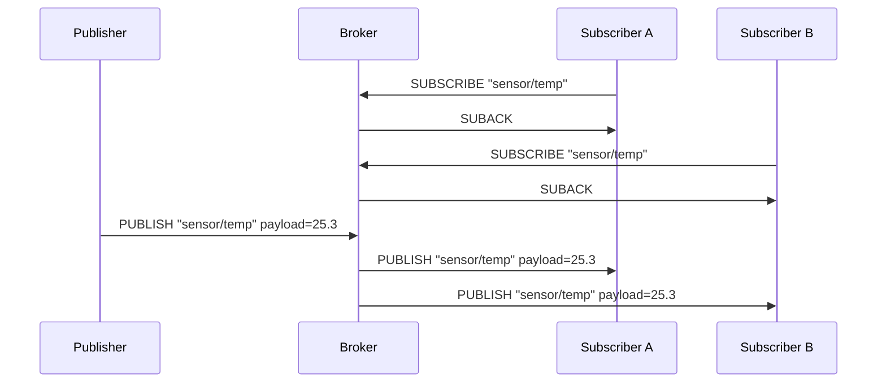

# Chapter 01: MQTTの概要

## 学習目標

- MQTT プロトコルの目的と歴史を理解する
- Pub/Sub（出版/購読）モデルの仕組みを把握する
- Broker / Publisher / Subscriber の3つの役割を説明できる
- HTTP や WebSocket との違いを整理し、MQTT が適するユースケースを挙げられる
- MQTT v3.1.1 の基本仕様を概観する
- 本プロジェクトのソースコード構成を把握する

---

## MQTTとは何か

MQTT（Message Queuing Telemetry Transport）は、**軽量なメッセージングプロトコル**である。
1999年に IBM の Andy Stanford-Clark と Arlen Nipper によって設計された。
当時の目的は、帯域幅が極めて限られた衛星回線上で
石油パイプラインのセンサーデータを効率よく転送することだった。

2014年に OASIS 標準として MQTT v3.1.1 が策定され、
IoT（Internet of Things）領域のデファクトプロトコルとして広く採用されている。
2019年には MQTT v5.0 も策定されたが、本プロジェクトでは v3.1.1 を対象とする。

主な特徴:

- **バイナリプロトコル** -- テキストベースの HTTP と異なり、ヘッダが極めてコンパクト（最小2バイト）
- **TCP 上で動作** -- 信頼性のあるトランスポート層を前提とする
- **非同期通信** -- Publisher と Subscriber は互いの存在を知る必要がない
- **QoS レベル** -- メッセージ配信の保証レベルを 0/1/2 の3段階で選べる
- **Keep Alive** -- 長時間接続を維持するための仕組みが組み込まれている

---

## Pub/Sub モデル

### 従来のクライアント・サーバモデルとの違い

HTTP に代表されるリクエスト/レスポンスモデルでは、
クライアントがサーバに直接リクエストを送り、サーバが応答を返す。
この方式では、サーバ側からクライアントに対して自発的にデータを送ることが難しい。

MQTT の Pub/Sub（Publish/Subscribe）モデルでは、
**Broker（仲介者）**を中心に通信が行われる。

```
Publisher ──PUBLISH──> Broker ──PUBLISH──> Subscriber
                         |
                         +──PUBLISH──> Subscriber
```

メッセージは**トピック**（例: `sensor/temperature`）に対して発行（Publish）され、
そのトピックを購読（Subscribe）しているクライアントに配信される。

### メッセージフローの詳細

以下のシーケンス図は、基本的なメッセージフローを示す。



### Pub/Sub モデルの利点

1. **疎結合**: Publisher は Subscriber の存在を知る必要がなく、逆もまた同様である
2. **スケーラビリティ**: Subscriber を追加しても Publisher の変更は不要
3. **非同期性**: Publisher と Subscriber が同時にオンラインである必要がない（QoS 1/2 の場合）
4. **多対多通信**: 1つのトピックに複数の Publisher と Subscriber が参加できる

---

## 3つの役割

### 1. Broker（ブローカー）

メッセージの中継・ルーティングを担当するサーバプロセス。
本プロジェクトでは `src/broker/` ディレクトリに実装している。

Broker の責務:
- クライアントの接続管理（CONNECT / CONNACK）
- トピックの購読管理（SUBSCRIBE / SUBACK）
- メッセージの配信（PUBLISH の転送とルーティング）
- Keep Alive の監視
- Retained メッセージの保持
- セッション管理

### 2. Publisher（パブリッシャー）

トピックに対してメッセージを発行するクライアント。
センサーデバイス、アプリケーションサーバ、API ゲートウェイなどが該当する。
本プロジェクトでは `src/publisher/main.zig` に実装例がある。

### 3. Subscriber（サブスクライバー）

トピックを購読し、メッセージを受信するクライアント。
ダッシュボード、ログ収集サービス、アラートシステムなどが該当する。
本プロジェクトでは `src/subscriber/main.zig` に実装例がある。

> **注意:** 1つのクライアントが Publisher と Subscriber の両方の役割を兼ねることができる。
> 例えば、温度センサーの値を PUBLISH しながら、設定変更のトピックを SUBSCRIBE する
> デバイスは珍しくない。

---

## HTTP / WebSocket との比較

| 観点               | HTTP                      | WebSocket                   | MQTT                        |
|-------------------|---------------------------|-----------------------------|-----------------------------|
| 通信モデル         | リクエスト/レスポンス       | 双方向ストリーム             | Pub/Sub（非同期）            |
| ヘッダサイズ       | 数百バイト〜               | 2〜14バイト                  | 最小2バイト                  |
| 方向性             | クライアント → サーバ       | 双方向                       | 双方向（Broker 経由）        |
| 接続維持           | 基本はステートレス          | 長時間接続                   | 長時間の TCP 接続を維持       |
| プッシュ通知       | ポーリング必須              | ネイティブ対応               | ネイティブ対応               |
| データ形式         | テキスト（JSON/XML）        | テキストまたはバイナリ        | バイナリ（任意のペイロード）  |
| 配信保証           | なし                       | なし                         | QoS 0/1/2                   |
| メッセージ境界     | Content-Length で管理       | フレーム単位                 | Remaining Length で管理      |
| ブローカーの要否   | 不要                       | 不要                         | 必須                         |

### なぜ MQTT を選ぶのか

- **帯域幅が限られる環境**: モバイル通信や衛星回線
- **大量のデバイスとの通信**: IoT で数千〜数百万台のデバイスを管理
- **配信保証が必要**: QoS 1/2 による確実なメッセージ配信
- **サーバからのプッシュ**: クライアントがポーリングする必要がない

---

## ユースケース

### IoT / センサーデータ収集

工場の温度センサーが `factory/line1/temp` にデータを Publish し、
監視システムが Subscribe する。MQTT の軽量さにより、
リソースの限られたマイクロコントローラでも実装できる。

### テレメトリ / 車両追跡

GPS トラッカーが位置情報を定期的に Publish し、
フリート管理システムがリアルタイムに受信する。
QoS 1 を使えば、ネットワークの一時的な断絶後も再送が保証される。

### チャット / 通知システム

ユーザーごとのトピック（`user/{id}/notifications`）を利用して、
プッシュ通知を配信する。Retained メッセージを使えば、
オフラインだったクライアントが接続した時点で最新の状態を取得できる。

### ホームオートメーション

照明やエアコンの操作コマンドを MQTT トピック経由で送受信する。
Home Assistant などのプラットフォームは MQTT を標準的に統合している。

---

## MQTT v3.1.1 の基本仕様

本プロジェクトは **MQTT v3.1.1**（OASIS Standard, 2014年10月）を対象とする。

### パケット種別

MQTT では以下の14種類の制御パケットが定義されている:

| 値  | パケット名      | 方向                | 説明                       |
|-----|----------------|---------------------|-----------------------------|
| 1   | CONNECT        | Client → Broker     | 接続要求                    |
| 2   | CONNACK        | Broker → Client     | 接続応答                    |
| 3   | PUBLISH        | 双方向              | メッセージ送信              |
| 4   | PUBACK         | 双方向              | QoS 1 確認応答              |
| 5   | PUBREC         | 双方向              | QoS 2 受信確認              |
| 6   | PUBREL         | 双方向              | QoS 2 解放                  |
| 7   | PUBCOMP        | 双方向              | QoS 2 完了                  |
| 8   | SUBSCRIBE      | Client → Broker     | トピック購読要求            |
| 9   | SUBACK         | Broker → Client     | 購読応答                    |
| 10  | UNSUBSCRIBE    | Client → Broker     | 購読解除要求                |
| 11  | UNSUBACK       | Broker → Client     | 購読解除応答                |
| 12  | PINGREQ        | Client → Broker     | キープアライブ要求          |
| 13  | PINGRESP       | Broker → Client     | キープアライブ応答          |
| 14  | DISCONNECT     | Client → Broker     | 切断通知                    |

### QoS レベル

- **QoS 0（At most once）**: 送りっぱなし。最もオーバーヘッドが少ないが、ロスの可能性あり
- **QoS 1（At least once）**: PUBACK で確認。確実に配信されるが、重複の可能性あり
- **QoS 2（Exactly once）**: 4ウェイハンドシェイク（PUBREC/PUBREL/PUBCOMP）。重複なしだがオーバーヘッド大

本プロジェクトでは QoS 0 と QoS 1 を実装対象としている。

### Keep Alive

クライアントは CONNECT パケットで Keep Alive 間隔（秒）を指定する。
この間隔内に通信がなければ、クライアントは PINGREQ を送り、
Broker は PINGRESP を返す。Keep Alive の 1.5 倍の時間応答がなければ、
Broker は接続を切断する。

### Retained メッセージ

PUBLISH の Retain フラグを 1 にすると、Broker はそのトピックの
最新メッセージを保持する。新たに Subscribe したクライアントは、
直ちにその保持メッセージを受信できる。

---

## 本プロジェクトの構成

```
mqtt_zig/
  src/
    mqtt/
      types.zig       -- QoS, PacketType, ConnectFlags 等の共有型定義
      packet.zig      -- 全パケット構造体と tagged union (Packet)
      codec.zig       -- パケットのエンコード/デコード
      topic.zig       -- トピックマッチングロジック
    broker/
      main.zig        -- Broker のエントリポイント (Juicy Main)
      server.zig      -- TCP リスナーと接続受付
      connection.zig  -- クライアント接続ハンドラ
      session.zig     -- セッション管理
      retain.zig      -- Retained メッセージストア
    client/
      client.zig      -- MQTT クライアントライブラリ
      transport.zig   -- TCP トランスポート層
    publisher/
      main.zig        -- Publisher のサンプル実装
    subscriber/
      main.zig        -- Subscriber のサンプル実装
  build.zig           -- Zig ビルド定義
  chapters/           -- 本チュートリアル
```

以降のチャプターでは、これらのソースコードを参照しながら
MQTT プロトコルと Zig 0.16 の実装技法を学んでいく。

---

## まとめ

- MQTT は**軽量・非同期・双方向**のメッセージングプロトコルである
- **Broker** を中心とした Pub/Sub モデルにより、疎結合な通信が実現できる
- HTTP は同期的なリクエスト/レスポンス、WebSocket は双方向ストリーム、MQTT は配信保証付きの Pub/Sub と、それぞれ異なる特性を持つ
- IoT / テレメトリ / 通知 / ホームオートメーションなど、リアルタイム通信シナリオに適している
- 本チュートリアルでは MQTT v3.1.1 を Pure Zig 0.16 で実装しながら学ぶ

次のチャプターでは、MQTT のバイナリプロトコルの構造を詳しく見ていく。
