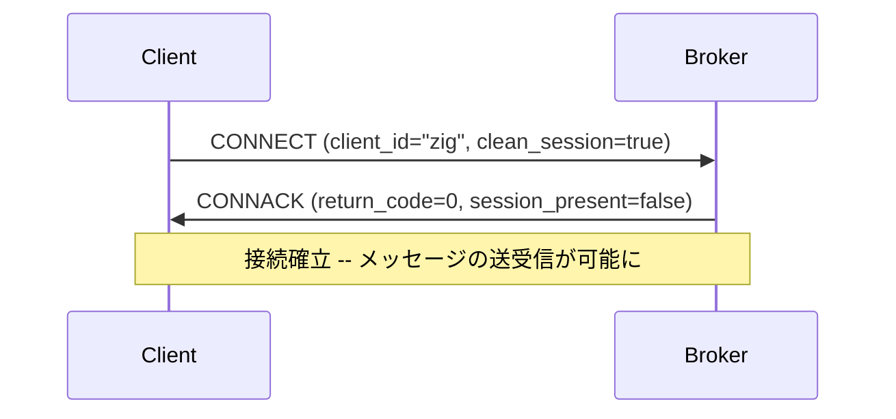

# Chapter 04: CONNECT / CONNACK

## 学習目標

- CONNECT パケットの完全な構造（可変ヘッダ + ペイロード）を理解する
- 接続フラグの各ビットの意味を把握する
- CONNACK パケットの構造と戻りコードを理解する
- Zig の `packed struct` で接続フラグを型安全に扱う方法を学ぶ
- 本プロジェクトの `codec.zig` でのエンコード/デコード実装を読み解く
- `union(PacketType)` による全パケット型の統一的な管理を理解する

---

## CONNECT パケットの全体構造

CONNECT は、クライアントが Broker に接続する際に送る最初のパケットである。

```
[固定ヘッダ]
  Byte 1: 0x10 (タイプ=1, フラグ=0)
  Byte 2+: Remaining Length

[可変ヘッダ]
  プロトコル名:    00 04 4D 51 54 54  ("MQTT")
  プロトコルレベル: 04                  (v3.1.1)
  接続フラグ:      1バイト
  Keep Alive:     2バイト (ビッグエンディアン u16)

[ペイロード] ※ 接続フラグに応じて可変
  クライアントID:  必須
  Will Topic:     接続フラグで Will=1 の場合
  Will Message:   接続フラグで Will=1 の場合
  Username:       接続フラグで Username=1 の場合
  Password:       接続フラグで Password=1 の場合
```

---

## 接続フラグ（Connect Flags）

接続フラグは1バイトで、各ビットに意味がある:

```
Bit:  7         6        5       4  3     2          1          0
      Username  Password Will    Will QoS Will       Clean      Reserved
      Flag      Flag     Retain            Flag      Session    (=0)
```

| ビット | フラグ名        | 説明                                     |
|--------|----------------|------------------------------------------|
| 7      | Username Flag  | ペイロードにユーザー名が含まれるか         |
| 6      | Password Flag  | ペイロードにパスワードが含まれるか         |
| 5      | Will Retain    | Will メッセージの Retain フラグ            |
| 4-3    | Will QoS       | Will メッセージの QoS レベル（0/1/2）      |
| 2      | Will Flag      | 遺言メッセージが設定されているか           |
| 1      | Clean Session  | 新規セッションとして接続するか             |
| 0      | Reserved       | 常に 0                                    |

---

## packed struct による接続フラグの表現

本プロジェクトの `types.zig` では、接続フラグを `packed struct(u8)` で定義している:

```zig
pub const ConnectFlags = packed struct(u8) {
    reserved: u1 = 0,          // bit 0: 予約（常に0）
    clean_session: bool = true, // bit 1: クリーンセッション
    will_flag: bool = false,    // bit 2: Will フラグ
    will_qos: u2 = 0,          // bits 3-4: Will QoS
    will_retain: bool = false,  // bit 5: Will Retain
    password_flag: bool = false,// bit 6: パスワードフラグ
    username_flag: bool = false,// bit 7: ユーザー名フラグ
};
```

### packed struct の特徴

- `packed struct(u8)` はメモリ上で正確に1バイトを占める
- フィールドはビット0から順に配置される
- `@bitCast` で `u8` との相互変換が可能
- 手動のビットマスク操作が不要になり、可読性とバグ耐性が向上する

### 使用例

```zig
// フラグの作成
const flags = ConnectFlags{
    .clean_session = true,
    .username_flag = true,
    .password_flag = true,
};

// u8 に変換
const byte: u8 = @bitCast(flags); // 0xC2

// u8 からフラグに変換
const parsed: ConnectFlags = @bitCast(@as(u8, 0xC2));
// parsed.clean_session == true
// parsed.username_flag == true
// parsed.password_flag == true
```

テストで検証:

```zig
test "ConnectFlags packed layout" {
    const flags = ConnectFlags{
        .clean_session = true,
        .username_flag = true,
        .password_flag = true,
    };
    const byte: u8 = @bitCast(flags);
    try std.testing.expectEqual(0xC2, byte);
}
```

フラグバイト `0xC2` の解析:

```
1100_0010
|||| |||+-- Reserved = 0
|||| ||+--- Clean Session = 1
|||| |+---- Will Flag = 0
||||++------ Will QoS = 0
|||+-------- Will Retain = 0
||+--------- Password Flag = 1
|+---------- Username Flag = 1
```

---

## Hex ダンプ例: CONNECT パケット

クライアントID = "zig-client"、Clean Session = true、Keep Alive = 60秒:

```
10 1A                           -- 固定ヘッダ: CONNECT, RL=26
00 04 4D 51 54 54               -- プロトコル名 "MQTT"
04                              -- プロトコルレベル 4
02                              -- 接続フラグ: Clean Session のみ
00 3C                           -- Keep Alive = 60
00 0A 7A 69 67 2D 63 6C 69     -- クライアントID "zig-client"
65 6E 74
```

---

## ConnectPacket 構造体

`packet.zig` で CONNECT パケットのデータ構造を定義している:

```zig
pub const ConnectPacket = struct {
    protocol_name: []const u8 = types.PROTOCOL_NAME,
    protocol_level: u8 = types.PROTOCOL_LEVEL,
    flags: ConnectFlags = .{},
    keep_alive: u16 = 60,
    client_id: []const u8,
    will_topic: ?[]const u8 = null,
    will_message: ?[]const u8 = null,
    username: ?[]const u8 = null,
    password: ?[]const u8 = null,
};
```

デフォルト値が設定されているため、最小限の初期化で使える:

```zig
const pkt = ConnectPacket{
    .client_id = "my-device",
};
// protocol_name = "MQTT", protocol_level = 4, keep_alive = 60,
// flags.clean_session = true が自動的に設定される
```

---

## CONNECT のエンコード

`codec.zig` の `encodeConnect` は `ManagedArrayList(u8)` を使って動的にバイト列を構築する:

```zig
pub fn encodeConnect(allocator: Allocator, pkt: *const ConnectPacket) ![]u8 {
    var list = ManagedArrayList(u8).init(allocator);
    errdefer list.deinit();

    // 可変ヘッダ: プロトコル名
    try appendString(&list, pkt.protocol_name);
    // プロトコルレベル
    try list.append(pkt.protocol_level);
    // 接続フラグ（packed struct -> u8）
    try list.append(@bitCast(pkt.flags));
    // Keep Alive
    try list.append(@intCast((pkt.keep_alive >> 8) & 0xFF));
    try list.append(@intCast(pkt.keep_alive & 0xFF));

    // ペイロード: クライアントID（必須）
    try appendString(&list, pkt.client_id);

    // Will Topic / Message（フラグに応じて）
    if (pkt.flags.will_flag) {
        if (pkt.will_topic) |t| try appendString(&list, t);
        if (pkt.will_message) |m| try appendString(&list, m);
    }

    // Username / Password（フラグに応じて）
    if (pkt.flags.username_flag) {
        if (pkt.username) |u| try appendString(&list, u);
    }
    if (pkt.flags.password_flag) {
        if (pkt.password) |p| try appendString(&list, p);
    }

    // 固定ヘッダを先頭に付加
    var result = ManagedArrayList(u8).init(allocator);
    errdefer result.deinit();
    var hdr_buf: [5]u8 = undefined;
    const hdr = try encodeFixedHeader(&hdr_buf, .connect, 0, @intCast(list.items.len));
    try result.appendSlice(hdr);
    try result.appendSlice(list.items);
    list.deinit();

    return result.toOwnedSlice();
}
```

ポイント:
- `@bitCast(pkt.flags)` で `ConnectFlags` (packed struct) を `u8` に変換
- ペイロードのフィールドは**仕様で定められた順序**で書き込む必要がある
- `errdefer list.deinit()` でエラー時のメモリリークを防止

---

## CONNECT のデコード

```zig
pub fn decodeConnect(allocator: Allocator, data: []const u8) !ConnectPacket {
    var pos: usize = 0;

    // プロトコル名
    const proto = try decodeString(data[pos..]);
    pos += proto.bytes_consumed;

    // プロトコルレベル
    if (pos >= data.len) return CodecError.PacketTooShort;
    const level = data[pos];
    pos += 1;

    // 接続フラグ（u8 -> packed struct）
    if (pos >= data.len) return CodecError.PacketTooShort;
    const flags: ConnectFlags = @bitCast(data[pos]);
    pos += 1;

    // Keep Alive
    const keep_alive = try decodeU16(data[pos..]);
    pos += 2;

    // ペイロード: クライアントID
    const cid = try decodeString(data[pos..]);
    pos += cid.bytes_consumed;
    const client_id = try allocator.dupe(u8, cid.value);
    errdefer allocator.free(client_id);

    // Will Topic / Message（フラグに応じて）
    var will_topic: ?[]const u8 = null;
    var will_message: ?[]const u8 = null;
    if (flags.will_flag) {
        const wt = try decodeString(data[pos..]);
        pos += wt.bytes_consumed;
        will_topic = try allocator.dupe(u8, wt.value);

        const wm = try decodeString(data[pos..]);
        pos += wm.bytes_consumed;
        will_message = try allocator.dupe(u8, wm.value);
    }

    // Username / Password（フラグに応じて）
    var username: ?[]const u8 = null;
    if (flags.username_flag) {
        const un = try decodeString(data[pos..]);
        pos += un.bytes_consumed;
        username = try allocator.dupe(u8, un.value);
    }

    var password: ?[]const u8 = null;
    if (flags.password_flag) {
        const pw = try decodeString(data[pos..]);
        pos += pw.bytes_consumed;
        password = try allocator.dupe(u8, pw.value);
    }

    return .{
        .protocol_name = proto.value,
        .protocol_level = level,
        .flags = flags,
        .keep_alive = keep_alive,
        .client_id = client_id,
        .will_topic = will_topic,
        .will_message = will_message,
        .username = username,
        .password = password,
    };
}
```

ポイント:
- `@bitCast(data[pos])` で `u8` を `ConnectFlags` (packed struct) に変換
- `allocator.dupe(u8, slice)` で文字列データをコピーし、所有権を呼び出し元に渡す
- `errdefer allocator.free(...)` でデコード途中のエラー時にメモリを確実に解放

---

## CONNACK パケット

Broker が CONNECT に応答して送る。常に固定長4バイトである。

```
[固定ヘッダ]
  Byte 1: 0x20 (タイプ=2, フラグ=0)
  Byte 2: 0x02 (Remaining Length = 2)

[可変ヘッダ]
  Byte 3: Session Present フラグ (0 or 1)
  Byte 4: 戻りコード
```

### 戻りコード

```zig
pub const ConnectReturnCode = enum(u8) {
    accepted = 0,              // 接続承認
    unacceptable_protocol = 1, // プロトコルバージョン不適合
    identifier_rejected = 2,   // クライアントID が不正
    server_unavailable = 3,    // サーバ利用不可
    bad_credentials = 4,       // ユーザー名/パスワード不正
    not_authorized = 5,        // 認証なし
    _,                         // 未知の値も受け入れる
};
```

`_` を定義することで、未知の戻りコード値を受信しても安全にデコードできる。

### Hex ダンプ例

```
成功:     20 02 00 00   -- Session Present=0, Return Code=0
拒否:     20 02 00 04   -- Session Present=0, Return Code=4 (認証エラー)
```

---

## CONNACK のエンコード/デコード

```zig
pub fn encodeConnack(buf: []u8, pkt: *const ConnackPacket) ![]const u8 {
    if (buf.len < 4) return CodecError.PacketTooShort;
    buf[0] = 0x20; // CONNACK type=2, flags=0
    buf[1] = 0x02; // remaining length = 2
    buf[2] = if (pkt.session_present) @as(u8, 0x01) else @as(u8, 0x00);
    buf[3] = @intFromEnum(pkt.return_code);
    return buf[0..4];
}

pub fn decodeConnack(data: []const u8) !ConnackPacket {
    if (data.len < 2) return CodecError.PacketTooShort;
    return .{
        .session_present = (data[0] & 0x01) != 0,
        .return_code = @enumFromInt(data[1]),
    };
}
```

CONNACK は固定長であるため、バッファベースのシンプルな実装になっている。
アロケータは不要である。

---

## Packet tagged union によるパケット管理

`packet.zig` では、全パケット種別を `union(PacketType)` で統一的に管理している:

```zig
pub const Packet = union(PacketType) {
    reserved: void,
    connect: ConnectPacket,
    connack: ConnackPacket,
    publish: PublishPacket,
    puback: PubackPacket,
    pubrec: PubackPacket,
    pubrel: PubackPacket,
    pubcomp: PubackPacket,
    subscribe: SubscribePacket,
    suback: SubackPacket,
    unsubscribe: UnsubscribePacket,
    unsuback: UnsubackPacket,
    pingreq: void,
    pingresp: void,
    disconnect: void,
    reserved2: void,
};
```

### パターンマッチで処理を分岐

```zig
fn handlePacket(pkt: Packet) void {
    switch (pkt) {
        .connect => |data| {
            std.log.info("CONNECT from: {s}", .{data.client_id});
        },
        .pingreq => {
            std.log.info("PINGREQ received", .{});
        },
        else => {},
    }
}
```

タグ付き共用体のメリット:
- 全パケット種別を**コンパイル時に網羅的にチェック**できる
- 各パケットに固有のデータ構造を安全に関連付けられる
- `switch` で `else` を省略すると、未処理のケースがコンパイルエラーになる

### パケットのメモリ解放

`freePacket` 関数がパケット種別に応じたメモリ解放を行う:

```zig
pub fn freePacket(allocator: Allocator, packet_val: *const Packet) void {
    switch (packet_val.*) {
        .connect => |p| {
            allocator.free(p.client_id);
            if (p.will_topic) |t| allocator.free(t);
            if (p.will_message) |m| allocator.free(m);
            if (p.username) |u| allocator.free(u);
            if (p.password) |pw| allocator.free(pw);
        },
        .publish => |p| {
            allocator.free(p.topic);
            allocator.free(p.payload);
        },
        else => {},
    }
}
```

---

## 接続フローの図解



---

## テスト

```zig
test "CONNECT: encode and decode round-trip" {
    const allocator = std.testing.allocator;
    const pkt = ConnectPacket{
        .client_id = "test-client",
        .flags = .{
            .clean_session = true,
            .username_flag = true,
            .password_flag = true,
        },
        .keep_alive = 60,
        .username = "user",
        .password = "pass",
    };
    const encoded = try encodeConnect(allocator, &pkt);
    defer allocator.free(encoded);

    const header = try decodeFixedHeader(encoded);
    const data = encoded[header.header_size..];
    const decoded = try decodeConnect(allocator, data);
    defer {
        allocator.free(decoded.client_id);
        if (decoded.username) |u| allocator.free(u);
        if (decoded.password) |p| allocator.free(p);
    }

    try std.testing.expectEqualStrings("test-client", decoded.client_id);
    try std.testing.expectEqual(true, decoded.flags.clean_session);
    try std.testing.expectEqual(@as(u16, 60), decoded.keep_alive);
    try std.testing.expectEqualStrings("user", decoded.username.?);
    try std.testing.expectEqualStrings("pass", decoded.password.?);
}

test "CONNACK: encode and decode" {
    var buf: [4]u8 = undefined;
    const pkt = ConnackPacket{
        .session_present = true,
        .return_code = .accepted,
    };
    const encoded = try encodeConnack(&buf, &pkt);
    try std.testing.expectEqual(@as(usize, 4), encoded.len);

    const decoded = try decodeConnack(encoded[2..]);
    try std.testing.expectEqual(true, decoded.session_present);
    try std.testing.expectEqual(ConnectReturnCode.accepted, decoded.return_code);
}
```

`std.testing.allocator` を使うことで、テスト終了時にメモリリークが自動検出される。

---

## まとめ

- CONNECT は**プロトコル名・レベル・接続フラグ・Keep Alive + ペイロード**で構成される
- 接続フラグの8ビットは `packed struct(u8)` で安全に扱え、`@bitCast` で `u8` と相互変換できる
- CONNACK は固定長4バイトで、戻りコードにより接続の成否を通知する
- `codec.zig` では `ManagedArrayList(u8)` でバイト列を動的に構築し、`errdefer` でメモリリークを防止している
- `packet.zig` の `union(PacketType)` で全パケット種別を型安全に管理する

次のチャプターでは、PUBLISH パケットと QoS フローを学ぶ。
