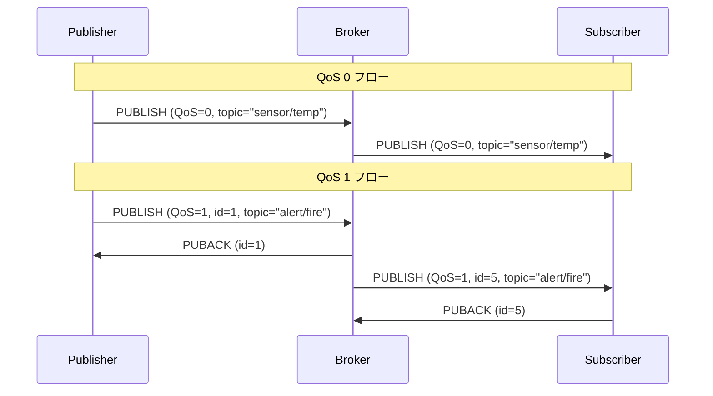

# Chapter 05: PUBLISHフロー

## 学習目標

- PUBLISH パケットの完全な構造（トピック、QoS、Retain、DUP、Packet ID、ペイロード）を理解する
- QoS 0（fire-and-forget）と QoS 1（PUBACK ハンドシェイク）のフローの違いを把握する
- 本プロジェクトの `codec.zig` での PUBLISH エンコード/デコードを読み解く
- Zig のオプショナル型（`?u16`）とエラーハンドリングを実践する
- `ManagedArrayList` を使った動的なパケット構築パターンを理解する

---

## PUBLISH パケットの構造

PUBLISH はメッセージを配信するための中核パケットである。

```
[固定ヘッダ]
  Byte 1:  [タイプ=3: 4bit][DUP: 1bit][QoS: 2bit][Retain: 1bit]
  Byte 2+: Remaining Length

[可変ヘッダ]
  トピック名:     MQTT文字列 (2バイト長 + UTF-8データ)
  Packet ID:     2バイト (QoS >= 1 の場合のみ)

[ペイロード]
  メッセージ本文:  任意のバイト列（残りの長さから算出）
```

### 固定ヘッダのフラグビット

PUBLISH パケットの第1バイトは他のパケットと異なり、フラグに意味がある:

```
Bit:  7  6  5  4  3     2  1     0
      0  0  1  1  DUP   QoS     Retain
      (タイプ=3)
```

| フラグ  | ビット | 説明                                         |
|---------|--------|----------------------------------------------|
| DUP     | 3      | 再送パケットかどうか（QoS > 0 で使用）        |
| QoS     | 2-1    | 配信品質レベル（0, 1, 2）                     |
| Retain  | 0      | Broker がこのメッセージを保持するか            |

### QoS 列挙型

本プロジェクトでは `types.zig` で QoS を列挙型として定義している:

```zig
pub const QoS = enum(u2) {
    at_most_once = 0,  // QoS 0: 最大1回配信（fire and forget）
    at_least_once = 1, // QoS 1: 最低1回配信（PUBACK で確認）
    exactly_once = 2,  // QoS 2: 正確に1回配信（4ステップ）

    pub fn fromInt(val: u2) QoS {
        return @enumFromInt(val);
    }
};
```

---

## PublishPacket 構造体

`packet.zig` で PUBLISH パケットのデータ構造を定義している:

```zig
pub const PublishPacket = struct {
    dup: bool = false,
    qos: QoS = .at_most_once,
    retain: bool = false,
    topic: []const u8,
    packet_id: ?u16 = null,  // QoS 0 の場合は null
    payload: []const u8,
};
```

### オプショナル型 `?u16` のポイント

`packet_id` が `?u16` である理由:
- QoS 0 では Packet ID フィールドが**パケットに存在しない**
- `null` で「フィールドが存在しない」ことを型レベルで表現できる
- `if (packet_id) |id|` パターンで安全にアンラップする

---

## Hex ダンプ例

### QoS 0: トピック "sensor/temp"、ペイロード "25.3"

```
30 11                           -- PUBLISH, DUP=0, QoS=0, Retain=0, RL=17
00 0B 73 65 6E 73 6F 72 2F     -- トピック名 "sensor/temp" (11バイト)
74 65 6D 70
32 35 2E 33                     -- ペイロード "25.3"
```

Packet ID は**存在しない**（QoS 0 のため）。

### QoS 1: トピック "sensor/temp"、Packet ID = 1、ペイロード "25.3"

```
32 13                           -- PUBLISH, DUP=0, QoS=1, Retain=0, RL=19
00 0B 73 65 6E 73 6F 72 2F     -- トピック名 "sensor/temp"
74 65 6D 70
00 01                           -- Packet ID = 1
32 35 2E 33                     -- ペイロード "25.3"
```

第1バイト `0x32` の解析:

```
0011_0010
||||_|||+-- Retain = 0
||||_|+---- QoS の下位ビット = 1
||||_+----- QoS の上位ビット = 0   -> QoS = 01 = 1
|||+------- DUP = 0
++++------- タイプ = 3 (PUBLISH)
```

---

## QoS 0: Fire-and-Forget

最もシンプルな配信方法。送信者は確認応答を待たない。

```
Publisher --PUBLISH(QoS=0)--> Broker --PUBLISH(QoS=0)--> Subscriber
```

- メッセージロスの可能性がある
- 最もオーバーヘッドが少ない
- センサーデータの定期送信など、多少のロスが許容されるケースに適する
- Packet ID が不要なため、パケットサイズが2バイト小さい

---

## QoS 1: At Least Once（PUBACK ハンドシェイク）

送信者は PUBACK を受信するまでメッセージを保持し、タイムアウト時に再送する。

```
Publisher --PUBLISH(QoS=1, id=1)--> Broker
Broker   --PUBACK(id=1)----------> Publisher
Broker   --PUBLISH(QoS=1, id=5)--> Subscriber
Subscriber--PUBACK(id=5)----------> Broker
```

- メッセージは**少なくとも1回**は配信される
- 重複配信の可能性がある（DUP フラグで識別）
- アラート通知など、確実な配信が必要なケースに適する
- Broker はメッセージを受信した時点で即座に購読者へ転送する

### PUBACK パケット

PUBACK は固定長4バイトのシンプルなパケットである:

```
40 02 00 01
|  |  +--+-- Packet ID = 1
|  +-------- Remaining Length = 2
+----------- タイプ=4 (PUBACK), フラグ=0
```

---

## QoS フローの図解



---

## PUBLISH のエンコード

`codec.zig` の `encodePublish` は `ManagedArrayList` を使って動的にバイト列を構築する:

```zig
pub fn encodePublish(allocator: Allocator, pkt: *const PublishPacket) ![]u8 {
    var list = ManagedArrayList(u8).init(allocator);
    errdefer list.deinit();

    // 可変ヘッダ: トピック名
    try appendString(&list, pkt.topic);

    // Packet ID（QoS > 0 の場合のみ）
    if (pkt.qos != .at_most_once) {
        const pid = pkt.packet_id orelse return CodecError.MalformedPacket;
        try list.append(@intCast((pid >> 8) & 0xFF));
        try list.append(@intCast(pid & 0xFF));
    }

    // ペイロード
    try list.appendSlice(pkt.payload);

    // 固定ヘッダのフラグを構築
    var flags: u4 = 0;
    if (pkt.dup) flags |= 0x08;
    flags |= @as(u4, @intFromEnum(pkt.qos)) << 1;
    if (pkt.retain) flags |= 0x01;

    // 固定ヘッダ + ペイロードを結合
    var result = ManagedArrayList(u8).init(allocator);
    errdefer result.deinit();
    var hdr_buf: [5]u8 = undefined;
    const hdr = try encodeFixedHeader(&hdr_buf, .publish, flags, @intCast(list.items.len));
    try result.appendSlice(hdr);
    try result.appendSlice(list.items);
    list.deinit();

    return result.toOwnedSlice();
}
```

ポイント:
- `pkt.packet_id orelse return CodecError.MalformedPacket` で QoS > 0 なのに Packet ID がない場合をエラーにする
- フラグビットは手動で組み立てる（DUP, QoS, Retain を個別にセット）
- 2つの `ManagedArrayList` を使い、まずペイロードを構築してから Remaining Length を確定する

---

## PUBLISH のデコード

```zig
pub fn decodePublish(allocator: Allocator, flags: u4, data: []const u8) !PublishPacket {
    // フラグビットの解析
    const dup = (flags & 0x08) != 0;
    const qos = QoS.fromInt(@intCast((flags >> 1) & 0x03));
    const retain = (flags & 0x01) != 0;

    var pos: usize = 0;

    // トピック名
    const topic_result = try decodeString(data[pos..]);
    pos += topic_result.bytes_consumed;
    const topic = try allocator.dupe(u8, topic_result.value);
    errdefer allocator.free(topic);

    // Packet ID（QoS >= 1 の場合のみ）
    var packet_id: ?u16 = null;
    if (qos != .at_most_once) {
        packet_id = try decodeU16(data[pos..]);
        pos += 2;
    }

    // 残りがペイロード
    const payload = try allocator.dupe(u8, data[pos..]);

    return .{
        .dup = dup,
        .qos = qos,
        .retain = retain,
        .topic = topic,
        .packet_id = packet_id,
        .payload = payload,
    };
}
```

ポイント:
- 固定ヘッダのフラグ（`u4`）は呼び出し元がデコード済みのものを渡す
- `QoS.fromInt()` で `u2` を QoS 列挙型に安全に変換
- `allocator.dupe` でトピックとペイロードをコピーし、呼び出し元に所有権を移転
- `errdefer allocator.free(topic)` でペイロードのコピー失敗時にトピックのメモリを確実に解放

---

## PUBACK のエンコード/デコード

```zig
pub fn encodePuback(buf: []u8, pkt: *const PubackPacket) ![]const u8 {
    if (buf.len < 4) return CodecError.PacketTooShort;
    buf[0] = 0x40;  // タイプ=4, フラグ=0
    buf[1] = 0x02;  // Remaining Length = 2
    buf[2] = @intCast((pkt.packet_id >> 8) & 0xFF);
    buf[3] = @intCast(pkt.packet_id & 0xFF);
    return buf[0..4];
}

pub fn decodePuback(data: []const u8) !PubackPacket {
    if (data.len < 2) return CodecError.PacketTooShort;
    return .{ .packet_id = try decodeU16(data) };
}
```

PUBACK は固定長であるため、バッファベースの実装でアロケータは不要。

---

## PUBLISH 処理のパターン

Broker が PUBLISH を受信した際の典型的な処理フロー:

```zig
fn handlePublish(data: PublishPacket, io: std.Io) !void {
    // 1. QoS 1 の場合は PUBACK を送信者に返す
    if (data.packet_id) |id| {
        var buf: [4]u8 = undefined;
        const puback_pkt = PubackPacket{ .packet_id = id };
        const puback = try encodePuback(&buf, &puback_pkt);
        try transport.send(puback);
    }

    // 2. トピックにマッチする全購読者にメッセージを転送
    // （topic.zig の topicMatchesFilter を使用）

    // 3. Retain フラグが true の場合、メッセージを保持
    if (data.retain) {
        // retain_store に保存
    }
}
```

### オプショナル型による QoS 分岐

```zig
fn processPublish(data: PublishPacket) !void {
    // QoS 1 の場合のみ PUBACK を送る
    if (data.packet_id) |id| {
        try sendPuback(id);
    }
    // QoS 0 の場合は packet_id == null なので何もしない
}
```

Zig の `if (optional) |unwrapped|` 構文により、
null チェックとアンラップが同時に行える。

---

## テスト

```zig
test "PUBLISH: encode and decode round-trip" {
    const allocator = std.testing.allocator;
    const pkt = PublishPacket{
        .topic = "sensor/temp",
        .payload = "25.5",
        .qos = .at_least_once,
        .packet_id = 42,
        .retain = true,
    };
    const encoded = try encodePublish(allocator, &pkt);
    defer allocator.free(encoded);

    const header = try decodeFixedHeader(encoded);
    const data = encoded[header.header_size..];
    const decoded = try decodePublish(allocator, header.flags, data);
    defer {
        allocator.free(decoded.topic);
        allocator.free(decoded.payload);
    }

    try std.testing.expectEqualStrings("sensor/temp", decoded.topic);
    try std.testing.expectEqualStrings("25.5", decoded.payload);
    try std.testing.expectEqual(QoS.at_least_once, decoded.qos);
    try std.testing.expectEqual(@as(?u16, 42), decoded.packet_id);
    try std.testing.expectEqual(true, decoded.retain);
}

test "PUBACK: encode and decode" {
    var buf: [4]u8 = undefined;
    const pkt = PubackPacket{ .packet_id = 1234 };
    const encoded = try encodePuback(&buf, &pkt);
    const decoded = try decodePuback(encoded[2..]);
    try std.testing.expectEqual(@as(u16, 1234), decoded.packet_id);
}
```

テストでは `std.testing.allocator` を使うことで、
`defer` で全てのメモリが正しく解放されることを自動検証している。

---

## エラーハンドリングのパターン

PUBLISH のデコードでは複数のエラーが発生しうる:

```zig
const CodecError = error{
    // ...
    MalformedPacket,   // QoS > 0 なのに Packet ID がない
    PacketTooShort,    // データが不足
    OutOfMemory,       // メモリ割り当て失敗
};
```

Zig のエラーユニオン (`!`) により、エラーの型が明示される。
呼び出し元は `try` で伝播するか、`catch` でハンドリングする:

```zig
const decoded = decodePublish(allocator, flags, data) catch |err| {
    switch (err) {
        error.PacketTooShort => std.log.err("パケットが短すぎます", .{}),
        error.OutOfMemory => std.log.err("メモリ不足", .{}),
        else => std.log.err("デコードエラー: {s}", .{@errorName(err)}),
    }
    return;
};
```

---

## まとめ

- PUBLISH パケットは**フラグビット（DUP/QoS/Retain）+ トピック + オプショナル Packet ID + ペイロード**で構成される
- QoS 0 は確認なしの送りっぱなし、QoS 1 は PUBACK による最低1回の配信保証
- `?u16`（オプショナル型）は Packet ID の有無を型安全に表現し、`if (opt) |val|` で安全にアンラップする
- `ManagedArrayList(u8)` で動的にバイト列を構築し、`errdefer` でエラー時のメモリリークを防止する
- `QoS` 列挙型（`enum(u2)`）により、QoS レベルを型安全に扱える

次のチャプターでは、SUBSCRIBE / UNSUBSCRIBE パケットを学ぶ。
