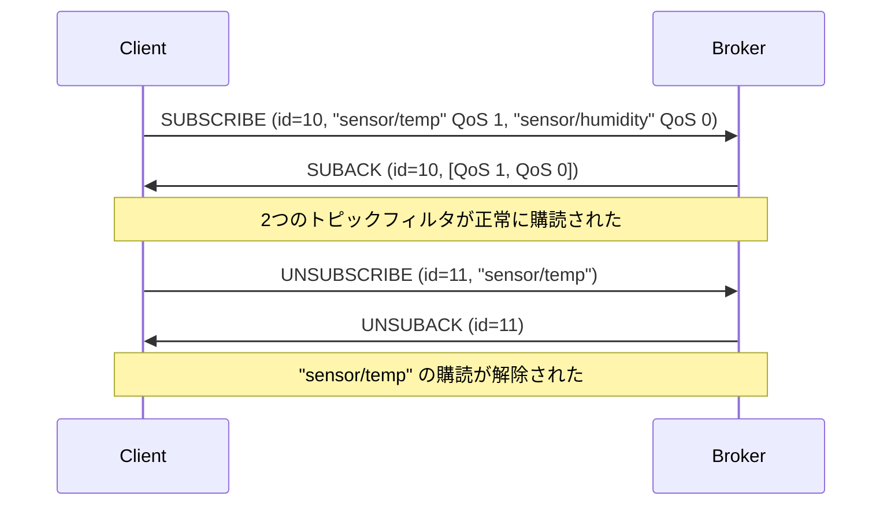

# Chapter 06: SUBSCRIBE / UNSUBSCRIBE

## 学習目標

- SUBSCRIBE パケットの構造（Packet ID + トピックフィルタリスト）を理解する
- SUBACK パケットの戻りコードの意味を把握する
- UNSUBSCRIBE / UNSUBACK のフローを理解する
- Zig 0.16 の `AlignedManaged` ArrayList パターンを習得する
- `errdefer` によるエラー時のメモリ安全性を理解する
- Broker 側の購読管理の仕組みを把握する

---

## SUBSCRIBE パケット

クライアントが Broker に対してトピックの購読を要求するパケット。

```
[固定ヘッダ]
  Byte 1: 0x82 (タイプ=8, フラグ=0010)
  Byte 2+: Remaining Length

[可変ヘッダ]
  Packet ID: 2バイト (ビッグエンディアン u16)

[ペイロード]
  トピックフィルタ1: MQTT文字列 + QoS (1バイト)
  トピックフィルタ2: MQTT文字列 + QoS (1バイト)
  ... (1つ以上必須)
```

> **注意:** SUBSCRIBE の固定ヘッダフラグは仕様上 `0010` (= 0x02) でなければならない。
> 他の値を受け取った場合は不正パケットとして接続を切断する。

---

## TopicFilter 構造体

本プロジェクトの `packet.zig` では、購読要素を以下の構造体で表す:

```zig
pub const TopicFilter = struct {
    filter: []const u8,
    qos: QoS,
};
```

`filter` はトピックフィルタ文字列（ワイルドカード `+` / `#` を含む場合がある）、
`qos` は要求する最大 QoS レベルである。

---

## Hex ダンプ例: SUBSCRIBE

トピック "sensor/temp" を QoS 1 で、"sensor/humidity" を QoS 0 で同時購読:

```
82 1E                           -- 固定ヘッダ: SUBSCRIBE, RL=30
00 0A                           -- Packet ID = 10

00 0B 73 65 6E 73 6F 72 2F     -- トピック "sensor/temp" (11バイト)
74 65 6D 70
01                              -- 要求 QoS = 1

00 0F 73 65 6E 73 6F 72 2F     -- トピック "sensor/humidity" (15バイト)
68 75 6D 69 64 69 74 79
00                              -- 要求 QoS = 0
```

---

## ManagedArrayList: Zig 0.16 の動的配列

本プロジェクトでは `std.array_list.AlignedManaged(T, null)` を使っている。
これは Zig 0.16 で提供される**アロケータ内蔵の動的配列**である。

### 定義

```zig
fn ManagedArrayList(comptime T: type) type {
    return std.array_list.AlignedManaged(T, null);
}
```

### 基本的な使い方

```zig
const allocator = init.gpa;

// 初期化（アロケータを保持する）
var list = ManagedArrayList(TopicFilter).init(allocator);
defer list.deinit(); // メモリ解放

// 要素の追加
try list.append(.{ .filter = "sensor/#", .qos = .at_least_once });
try list.append(.{ .filter = "alert/+", .qos = .at_most_once });

// 要素数の取得
const count = list.items.len; // 2

// スライスとして所有権を移転
const owned = try list.toOwnedSlice();
// 呼び出し元が allocator.free(owned) で解放する責任を持つ
```

### ArrayList との違い

| 特徴 | `std.ArrayList(T)` | `AlignedManaged(T, null)` |
|------|--------------------|-----------------------------|
| アロケータ | `init(allocator)` で保持 | `init(allocator)` で保持 |
| アライメント | デフォルト | 明示的に指定可能（null = デフォルト）|
| Zig 0.16 推奨 | -- | 推奨 |

---

## SUBSCRIBE のエンコード

```zig
pub fn encodeSubscribe(allocator: Allocator, pkt: *const SubscribePacket) ![]u8 {
    var list = ManagedArrayList(u8).init(allocator);
    errdefer list.deinit();

    // Packet ID
    try list.append(@intCast((pkt.packet_id >> 8) & 0xFF));
    try list.append(@intCast(pkt.packet_id & 0xFF));

    // トピックフィルタのリスト
    for (pkt.topics) |tf| {
        try appendString(&list, tf.filter);
        try list.append(@intFromEnum(tf.qos));
    }

    // 固定ヘッダ + ペイロードを結合
    var result = ManagedArrayList(u8).init(allocator);
    errdefer result.deinit();
    var hdr_buf: [5]u8 = undefined;
    const hdr = try encodeFixedHeader(&hdr_buf, .subscribe, 0x02, @intCast(list.items.len));
    try result.appendSlice(hdr);
    try result.appendSlice(list.items);
    list.deinit();

    return result.toOwnedSlice();
}
```

ポイント:
- 固定ヘッダのフラグは仕様上 `0x02` 固定
- `@intFromEnum(tf.qos)` で QoS 列挙型を `u8` に変換
- 2つの `ManagedArrayList` を使い、まずペイロードを構築してから Remaining Length を確定する

---

## SUBSCRIBE のデコード

```zig
pub fn decodeSubscribe(allocator: Allocator, data: []const u8) !SubscribePacket {
    if (data.len < 2) return CodecError.PacketTooShort;
    var pos: usize = 0;

    // Packet ID
    const packet_id = try decodeU16(data[pos..]);
    pos += 2;

    // トピックフィルタのリストを動的に構築
    var topics = ManagedArrayList(TopicFilter).init(allocator);
    errdefer {
        for (topics.items) |tf| allocator.free(tf.filter);
        topics.deinit();
    }

    while (pos < data.len) {
        // トピック文字列を読む
        const filter_result = try decodeString(data[pos..]);
        pos += filter_result.bytes_consumed;

        if (pos >= data.len) return CodecError.PacketTooShort;

        // QoS バイトを読む
        const qos_byte = data[pos];
        pos += 1;

        // フィルタ文字列をコピーして追加
        const filter_copy = try allocator.dupe(u8, filter_result.value);
        try topics.append(.{
            .filter = filter_copy,
            .qos = QoS.fromInt(@intCast(qos_byte & 0x03)),
        });
    }

    return .{
        .packet_id = packet_id,
        .topics = try topics.toOwnedSlice(),
    };
}
```

### errdefer パターンの詳細

```zig
var topics = ManagedArrayList(TopicFilter).init(allocator);
errdefer {
    // エラー時: 既に追加した全フィルタ文字列を解放
    for (topics.items) |tf| allocator.free(tf.filter);
    // リスト自体のメモリも解放
    topics.deinit();
}
```

この `errdefer` ブロックは以下の状況で発動する:
- `decodeString` がエラーを返した場合
- `allocator.dupe` がメモリ不足で失敗した場合
- `topics.append` がメモリ不足で失敗した場合

成功時は `toOwnedSlice()` で所有権が呼び出し元に移転するため、
`errdefer` は発動しない。

---

## SUBACK パケット

Broker が SUBSCRIBE に応答して送る。各トピックフィルタに対する結果を返す。

```
[固定ヘッダ]
  Byte 1: 0x90 (タイプ=9, フラグ=0)
  Byte 2+: Remaining Length

[可変ヘッダ]
  Packet ID: 2バイト（SUBSCRIBE と同じ値）

[ペイロード]
  戻りコード1: 1バイト
  戻りコード2: 1バイト
  ... (SUBSCRIBE のトピック数と同じ数)
```

### SUBACK 戻りコード

```zig
pub const SubackReturnCode = enum(u8) {
    success_qos0 = 0x00, // 成功: 最大 QoS 0 で承認
    success_qos1 = 0x01, // 成功: 最大 QoS 1 で承認
    success_qos2 = 0x02, // 成功: 最大 QoS 2 で承認
    failure = 0x80,       // 失敗: 購読拒否
    _,                    // 未知の値
};
```

> Broker は要求された QoS より低い QoS を付与することがある。
> 例: QoS 2 を要求しても、Broker が QoS 1 までしかサポートしない場合は `0x01` を返す。

### Hex ダンプ例

```
90 04                   -- 固定ヘッダ: SUBACK, RL=4
00 0A                   -- Packet ID = 10 (SUBSCRIBE と同じ)
01                      -- トピック1: QoS 1 で承認
00                      -- トピック2: QoS 0 で承認
```

---

## SUBACK のエンコード/デコード

### エンコード

```zig
pub fn encodeSuback(allocator: Allocator, pkt: *const SubackPacket) ![]u8 {
    const payload_len: u32 = @intCast(2 + pkt.return_codes.len);

    var result = ManagedArrayList(u8).init(allocator);
    errdefer result.deinit();

    var hdr_buf: [5]u8 = undefined;
    const hdr = try encodeFixedHeader(&hdr_buf, .suback, 0, payload_len);
    try result.appendSlice(hdr);

    // Packet ID
    try result.append(@intCast((pkt.packet_id >> 8) & 0xFF));
    try result.append(@intCast(pkt.packet_id & 0xFF));

    // 戻りコード
    for (pkt.return_codes) |rc| {
        try result.append(@intFromEnum(rc));
    }

    return result.toOwnedSlice();
}
```

### デコード

```zig
pub fn decodeSuback(allocator: Allocator, data: []const u8) !SubackPacket {
    if (data.len < 3) return CodecError.PacketTooShort;
    const packet_id = try decodeU16(data[0..]);
    const codes_data = data[2..];
    const return_codes = try allocator.alloc(SubackReturnCode, codes_data.len);
    for (codes_data, 0..) |byte, i| {
        return_codes[i] = @enumFromInt(byte);
    }
    return .{
        .packet_id = packet_id,
        .return_codes = return_codes,
    };
}
```

`@enumFromInt(byte)` で各バイトを `SubackReturnCode` に変換する。
`_` が定義されているため、未知の値でもパニックせずにデコードできる。

---

## UNSUBSCRIBE パケット

購読を解除するパケット。SUBSCRIBE と似た構造だが、QoS フィールドがない。

```
[固定ヘッダ]
  Byte 1: 0xA2 (タイプ=10, フラグ=0010)
  Byte 2+: Remaining Length

[可変ヘッダ]
  Packet ID: 2バイト

[ペイロード]
  トピックフィルタ1: MQTT文字列
  トピックフィルタ2: MQTT文字列
  ... (1つ以上必須)
```

### Hex ダンプ例

```
A2 0F                           -- UNSUBSCRIBE, RL=15
00 0B                           -- Packet ID = 11
00 0B 73 65 6E 73 6F 72 2F     -- "sensor/temp" (11バイト)
74 65 6D 70
```

### UNSUBSCRIBE のデコード

```zig
pub fn decodeUnsubscribe(allocator: Allocator, data: []const u8) !UnsubscribePacket {
    if (data.len < 2) return CodecError.PacketTooShort;
    var pos: usize = 0;
    const packet_id = try decodeU16(data[pos..]);
    pos += 2;

    var topics = ManagedArrayList([]const u8).init(allocator);
    errdefer {
        for (topics.items) |t| allocator.free(t);
        topics.deinit();
    }

    while (pos < data.len) {
        const s = try decodeString(data[pos..]);
        pos += s.bytes_consumed;
        try topics.append(try allocator.dupe(u8, s.value));
    }

    return .{
        .packet_id = packet_id,
        .topics = try topics.toOwnedSlice(),
    };
}
```

SUBSCRIBE と同じく `ManagedArrayList` と `errdefer` パターンを使用する。
QoS フィールドがないため、トピック文字列のみを読み取る。

---

## UNSUBACK パケット

UNSUBSCRIBE に対する応答。固定長4バイト。

```
B0 02 00 0B
|  |  +--+-- Packet ID = 11
|  +-------- Remaining Length = 2
+----------- タイプ=11 (UNSUBACK), フラグ=0
```

```zig
pub fn encodeUnsuback(buf: []u8, pkt: *const UnsubackPacket) ![]const u8 {
    if (buf.len < 4) return CodecError.PacketTooShort;
    buf[0] = 0xB0; // UNSUBACK type=11, flags=0
    buf[1] = 0x02;
    buf[2] = @intCast((pkt.packet_id >> 8) & 0xFF);
    buf[3] = @intCast(pkt.packet_id & 0xFF);
    return buf[0..4];
}
```

---

## 購読フローの図解



---

## Broker の購読管理

Broker はクライアントごとの購読情報を管理する必要がある。
`HashMap` と `ManagedArrayList` を組み合わせて実装する:

```zig
const Subscription = struct {
    client_id: []const u8,
    qos: QoS,
};

const SubscriptionManager = struct {
    subscriptions: std.StringHashMap(ManagedArrayList(Subscription)),
    allocator: Allocator,

    pub fn init(allocator: Allocator) SubscriptionManager {
        return .{
            .subscriptions = std.StringHashMap(
                ManagedArrayList(Subscription),
            ).init(allocator),
            .allocator = allocator,
        };
    }

    pub fn subscribe(
        self: *SubscriptionManager,
        filter: []const u8,
        client_id: []const u8,
        qos: QoS,
    ) !void {
        const result = try self.subscriptions.getOrPut(filter);
        if (!result.found_existing) {
            result.value_ptr.* = ManagedArrayList(Subscription).init(self.allocator);
        }
        try result.value_ptr.append(.{
            .client_id = client_id,
            .qos = qos,
        });
    }

    pub fn unsubscribe(
        self: *SubscriptionManager,
        filter: []const u8,
        client_id: []const u8,
    ) void {
        if (self.subscriptions.getPtr(filter)) |subs| {
            var i: usize = 0;
            while (i < subs.items.len) {
                if (std.mem.eql(u8, subs.items[i].client_id, client_id)) {
                    _ = subs.swapRemove(i);
                } else {
                    i += 1;
                }
            }
        }
    }
};
```

### メモリ管理のパターン

```zig
// テスト時: std.testing.allocator でメモリリーク検出
test "subscribe and unsubscribe" {
    const allocator = std.testing.allocator;
    var manager = SubscriptionManager.init(allocator);
    defer manager.deinit();

    try manager.subscribe("sensor/+", "client-1", .at_least_once);
    try manager.subscribe("sensor/+", "client-2", .at_most_once);

    manager.unsubscribe("sensor/+", "client-1");
    // テスト終了時にメモリリークがあれば自動検出される
}
```

---

## テスト

```zig
test "SUBSCRIBE: encode and decode round-trip" {
    const allocator = std.testing.allocator;
    const topics = [_]TopicFilter{
        .{ .filter = "sensor/+/temp", .qos = .at_least_once },
        .{ .filter = "alert/#", .qos = .at_most_once },
    };
    const pkt = SubscribePacket{
        .packet_id = 100,
        .topics = &topics,
    };
    const encoded = try encodeSubscribe(allocator, &pkt);
    defer allocator.free(encoded);

    const header = try decodeFixedHeader(encoded);
    const data = encoded[header.header_size..];
    const decoded = try decodeSubscribe(allocator, data);
    defer {
        for (decoded.topics) |tf| allocator.free(tf.filter);
        allocator.free(decoded.topics);
    }

    try std.testing.expectEqual(@as(u16, 100), decoded.packet_id);
    try std.testing.expectEqual(@as(usize, 2), decoded.topics.len);
    try std.testing.expectEqualStrings("sensor/+/temp", decoded.topics[0].filter);
    try std.testing.expectEqual(QoS.at_least_once, decoded.topics[0].qos);
    try std.testing.expectEqualStrings("alert/#", decoded.topics[1].filter);
    try std.testing.expectEqual(QoS.at_most_once, decoded.topics[1].qos);
}
```

テストでは:
- `std.testing.allocator` を使いメモリリークを自動検出
- `defer` でデコード結果のメモリを確実に解放
- ラウンドトリップ（エンコード → デコード → 比較）で正確性を検証

---

## メモリ解放の全体像

`packet.zig` の `freePacket` 関数がパケット種別に応じた解放を行う:

```zig
pub fn freePacket(allocator: Allocator, packet_val: *const Packet) void {
    switch (packet_val.*) {
        .subscribe => |p| {
            for (p.topics) |tf| {
                allocator.free(tf.filter);
            }
            allocator.free(p.topics);
        },
        .unsubscribe => |p| {
            for (p.topics) |t| {
                allocator.free(t);
            }
            allocator.free(p.topics);
        },
        .suback => |p| {
            allocator.free(p.return_codes);
        },
        // ... 他のパケット種別 ...
        else => {},
    }
}
```

`tagged union` の `switch` で全パケット種別を網羅的に処理できる。

---

## まとめ

- SUBSCRIBE は **Packet ID + トピックフィルタ/QoS のリスト** で構成される
- SUBACK は各フィルタに対する承認 QoS（または拒否 `0x80`）を返す
- UNSUBSCRIBE / UNSUBACK は購読解除のペアで、Packet ID で対応付ける
- Zig 0.16 の `AlignedManaged(T, null)` はアロケータ内蔵の動的配列であり、SUBSCRIBE のような可変長ペイロードの構築・デコードに適している
- `errdefer` パターンにより、デコード途中のエラーでもメモリリークを防止できる
- Broker 側は `HashMap` + `ManagedArrayList` で購読情報を管理する

次のチャプターでは、トピックフィルタのワイルドカードマッチングを学ぶ。
